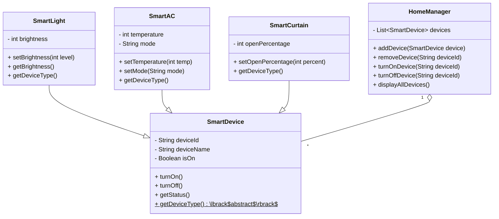

```mermaid
classDiagram
    class SmartDevice {
        - String deviceId
        - String deviceName
        - Boolean isOn
        + turnOn()
        + turnOff()
        + getStatus()
        + getDeviceType()$\lbrack$abstract$\rbrack$
    }
    class SmartLight {
        - int brightness
        + setBrightness(int level)
        + getBrightness()
        + getDeviceType()
    }
    class SmartAC {
        - int temperature
        - String mode
        + setTemperature(int temp)
        + setMode(String mode)
        + getDeviceType()
    }
    class SmartCurtain {
        - int openPercentage
        + setOpenPercentage(int percent)
        + getDeviceType()
    }
    class HomeManager {
        - List~SmartDevice~ devices
        + addDevice(SmartDevice device)
        + removeDevice(String deviceId)
        + turnOnDevice(String deviceId)
        + turnOffDevice(String deviceId)
        + displayAllDevices()
    }
    SmartLight --|> SmartDevice
    SmartAC --|> SmartDevice
    SmartCurtain --|> SmartDevice
    HomeManager "1" o-- "*" SmartDevice
```